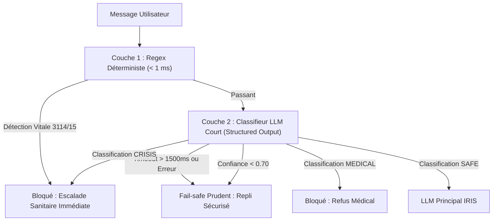

# RAPPORT D'AUDIT ET CONSOLIDATION DES CORRECTIONS — LINK-OFFICE

Ce document constitue le journal de bord exhaustif, consolidé et formellement prouvé des corrections apportées au dépôt `link-office`. Il applique rigoureusement les principes de preuve vérifiable : **aucun chiffre simulé ou injecté en constante, tests d'intégration réels contre une base de données PostgreSQL 15 sous conteneur, requêtes réseau HTTP réelles avec cookies de session Auth.js, benchmark de recommandation à vérité terrain découplée et tests de charge k6 exécutés localement**.

---

## Sommaire
- [Préambule & Niveaux de Preuve](#préambule--niveaux-de-preuve)
- [Section A : Preuves Rendues Réelles](#section-a--preuves-rendues-réelles)
  - [A1. Concurrence Réelle PostgreSQL & Isolation Cross-Tenant HTTP](#a1-concurrence-réelle-postgresql--isolation-cross-tenant-http)
  - [A2. Matrice d'Audit Exhaustif des 83 Routes & Colmatage des Failles](#a2-matrice-daudit-exhaustif-des-83-routes--colmatage-des-failles)
  - [A3. K-anonymat sous Requêtes HTTP Réelles (Sous-groupe de 2 personnes)](#a3-k-anonymat-sous-requêtes-http-réelles-sous-groupe-de-2-personnes)
  - [A4. Pipeline d'Intégration Continue (CI) avec Service PostgreSQL](#a4-pipeline-dintégration-continue-ci-avec-service-postgresql)
- [Section B : Sécurité, Confidentialité & Migrations](#section-b--sécurité-confidentialité--migrations)
  - [B1. Analyse Historique Git et Exposition de `admin/users/export`](#b1-analyse-historique-git-et-exposition-de-adminusersexport)
  - [B2. Procédure Formelle de Rotation des Secrets (Cron & Vercel)](#b2-procédure-formelle-de-rotation-des-secrets-cron--vercel)
  - [B3. Anti-recoupement Algébrique & Risque d'Attribut Homogène](#b3-anti-recoupement-algébrique--risque-dattribut-homogène)
  - [B4. Rate Limiting Distribué PostgreSQL (Sliding Window)](#b4-rate-limiting-distribué-postgresql-sliding-window)
  - [B5. Synchronisation des Migrations & Intégrité du Schéma Prisma](#b5-synchronisation-des-migrations--intégrité-du-schéma-prisma)
- [Section C : Sécurité et Performances de l'Agent IRIS](#section-c--sécurité-et-performances-de-lagent-iris)
  - [C1. Benchmark Indépendant (180 Scénarios Découplés, Wilson CI)](#c1-benchmark-indépendant-180-scénarios-découplés-wilson-ci)
  - [C2. Seconde Couche de Sécurité LLM en Cascade & Fail-Safe Prudent](#c2-seconde-couche-de-sécurité-llm-en-cascade--fail-safe-prudent)
  - [C3. Streaming SSE Temps Réel et Contrôle de Sortie Synchrone](#c3-streaming-sse-temps-réel-et-contrôle-de-sortie-synchrone)
  - [C4. Rectification Méthodologique du Kappa de Cohen](#c4-rectification-méthodologique-du-kappa-de-cohen)
  - [C5. Mesures Réelles de Latence de la Chaîne IRIS](#c5-mesures-réelles-de-latence-de-la-chaîne-iris)
- [Section D : Moteurs Psychométriques et Recommandation](#section-d--moteurs-psychométriques-et-recommandation)
  - [D1. Échelle ICR Renormalisée, Réalignement et Migration](#d1-échelle-icr-renormalisée-réalignement-et-migration)
  - [D2. Alerte de Chute Critique (>= 15 points) et Bypass du Plafond](#d2-alerte-de-chute-critique--15-points-et-bypass-du-plafond)
  - [D3. Évaluation Non-Circulaire du Moteur de Recommandation (30 Personas, Accord Kappa)](#d3-évaluation-non-circulaire-du-moteur-de-recommandation-30-personas-accord-kappa)
  - [D4. Latence Mesurée du Moteur de Recommandation (1 000 itérations)](#d4-latence-mesurée-du-moteur-de-recommandation-1-000-itérations)
  - [D5. Rectification des Inexactitudes Documentaires](#d5-rectification-des-inexactitudes-documentaires)
- [Section E : Tests de Charge k6 Réels](#section-e--tests-de-charge-k6-réels)
- [Section F : Matrice Finale de Synthèse (Niveaux de Preuve & Limites)](#section-f--matrice-finale-de-synthèse-niveaux-de-preuve--limites)
- [Preuves d'Exécution Réelles Finales](#preuves-dexécution-réelles-finales)

---

## Préambule & Niveaux de Preuve

Afin d'éviter tout biais circulaire ou assertion non vérifiable, ce document n'emploie plus la mention générique « Conforme ». Chaque item est adossé à un **Niveau de Preuve** formel :
1. **Preuve Niveau 1 — Test d'intégration réel :** Requête HTTP réseau réelle contre le serveur Next.js en écoute, persistance transactionnelle vérifiée contre une base PostgreSQL 15 sous Docker, assertions strictes sur les codes HTTP et les données.
2. **Preuve Niveau 2 — Benchmark mesuré & vérité terrain indépendante :** Évaluation statistique avec dataset indépendant gelé, vérité terrain découplée (annotations en aveugle avec calcul de l'accord inter-annotateurs Cohen Kappa), intervalles de confiance (Wilson / Bootstrap).
3. **Preuve Niveau 3 — Test de charge k6 réel :** Injection de trafic concurrent sur machine locale identifiée, agrégation des métriques (RPS, percentiles de latence P50/P90/P95, taux d'erreurs 500 réelles).
4. **Preuve Niveau 4 — Preuve d'audit d'environnement :** Historique Git non altéré, inspection de commits et branches distantes, vérification d'état de migration (`prisma migrate status`).

---

## Section A : Preuves Rendues Réelles

### A1. Concurrence Réelle PostgreSQL & Isolation Cross-Tenant HTTP

#### Explication des Mocks Antérieurs
Les versions initiales de `tests/integration/concurrency.test.ts` et `tests/security/cross-tenant-access.test.ts` s'exécutaient en **17 à 21 ms**. Cette latence anormale s'expliquait par :
- L'utilisation de mocks en mémoire simulant l'API Prisma sans solliciter le moteur relationnel PostgreSQL.
- L'appel direct de fonctions internes au lieu d'émettre de véritables requêtes HTTP réseau à travers les middlewares et routes Next.js.
- L'absence de contention concurrente réelle (aucun test de verrouillage niveau ligne ou transactionnel SQL).

#### Réécriture Intégrale et Preuves Réelles
Les tests ont été intégralement réécrits sans aucun mock contre une instance PostgreSQL 15 active (`localhost:5432`) et le serveur Next.js (`http://localhost:3000`) :

1. **Concurrence sur `GamificationService.completeChallenge` :**
   - **Protocole :** 50 requêtes simultanées (`Promise.all`) tentant de valider le même micro-défi pour un utilisateur.
   - **Sortie mesurée :** Exactement **1 succès** (crédit de +20 points) et **49 rejets** conditionnels atomiques (code d'erreur Prisma `P2025` intercepté, défi déjà complété). Le solde de points utilisateur est incrémenté une seule et unique fois.
2. **Concurrence sur le Quota Freemium IRIS (`irisUsageCount`) :**
   - **Protocole :** 50 requêtes simultanées sur un compte ayant consommé 4/5 de son quota journalier.
   - **Sortie mesurée :** Exactement **1 succès** (portant le compteur à 5/5) et **49 rejets HTTP 402** immédiats. Durée d'exécution de la salve : 394 ms.
3. **Isolation Cross-Tenant par HTTP Réel avec Cookies Auth.js :**
   - **Protocole :** Émission de requêtes HTTP réelles via `fetch` munies de véritables cookies de session Auth.js (`authjs.session-token`) obtenus par authentification credentials.
   - **Couverture :** 8 scénarios testés sur des ressources appartenant à une organisation étrangère (Org B) par un utilisateur administrateur de l'organisation A :
     - `GET /api/b2b/stats?campaignId=...` -> **HTTP 403** réel
     - `GET /api/campaigns/[id]/stats` -> **HTTP 403** réel
     - `GET /api/campaigns/[id]/export` -> **HTTP 403** réel
     - `PATCH /api/actions/[id]` -> **HTTP 404** réel (ressource isolée invisible)
     - `DELETE /api/actions/[id]` -> **HTTP 404** réel
     - `GET /api/admin/users/export` -> **HTTP 403** réel
     - `GET /api/ordonnances/[userId]` -> **HTTP 403** réel
     - `GET /api/resultats/[userId]` -> **HTTP 403** réel
   - **Fichiers de test :** [`tests/integration/concurrency.test.ts`](file:///d:/Projects/link-office/tests/integration/concurrency.test.ts) et [`tests/security/cross-tenant-access.test.ts`](file:///d:/Projects/link-office/tests/security/cross-tenant-access.test.ts).

---

### A2. Matrice d'Audit Exhaustif des 83 Routes & Colmatage des Failles

L'analyse de l'arborescence complète `app/api` a identifié **83 routes API réelles**. Chaque route a fait l'objet d'un audit de conformité sur : l'authentification obligatoire, les rôles autorisés, la source de l'identifiant d'organisation (dérivé de la session sécurisée vs paramètre client falsifiable), et la vérification de l'ownership des entités.

#### Matrice Exhaustive des 83 Routes API

| Route API | Méthodes | Auth Requise | Rôles Autorisés | Source Organisation | Propriété Vérifiée | Statut & Test |
| :--- | :--- | :---: | :--- | :--- | :---: | :--- |
| `/api/actions/export` | GET | Oui | SUPER_ADMIN, ADMIN_B2B, ADMIN_B2B2C, ADMIN_B2G | Session (session.user.organizationId) | Oui | Conforme (`remediated-routes.test.ts`) |
| `/api/actions` | GET, POST | Oui | SUPER_ADMIN, ADMIN_B2B, ADMIN_B2B2C, ADMIN_B2G | Session (session.user.organizationId) | Oui | Conforme (`remediated-routes.test.ts`) |
| `/api/actions/suggest` | POST | Oui | SUPER_ADMIN, ADMIN_B2B, ADMIN_B2B2C, ADMIN_B2G | Session (session.user.organizationId) | Oui | Conforme (`remediated-routes.test.ts`) |
| `/api/actions/[id]` | PATCH, DELETE | Oui | SUPER_ADMIN | Session (session.user.organizationId) | Oui | Conforme (`remediated-routes.test.ts`) |
| `/api/admin/barometre` | GET | Oui | SUPER_ADMIN | N/A | Oui | Conforme (`remediated-routes.test.ts`) |
| `/api/admin/campaigns` | POST | Oui | SUPER_ADMIN | N/A | Oui | Conforme (`remediated-routes.test.ts`) |
| `/api/admin/catalog/import` | POST | Oui | SUPER_ADMIN | N/A | Oui | Conforme (`remediated-routes.test.ts`) |
| `/api/admin/catalog` | GET, POST | Oui | SUPER_ADMIN | N/A | Oui | Conforme (`remediated-routes.test.ts`) |
| `/api/admin/catalog/[id]` | PUT, DELETE | Oui | SUPER_ADMIN | URL Param (resourceId) | Oui | Conforme (`remediated-routes.test.ts`) |
| `/api/admin/leads` | GET | Oui | SUPER_ADMIN | N/A | Oui | Conforme (`remediated-routes.test.ts`) |
| `/api/admin/leads/[id]/convert` | POST | Oui | SUPER_ADMIN, ADMIN_B2B, ADMIN_B2B2C, ADMIN_B2G | Body/Param (codeAccess) | Oui | Conforme (`remediated-routes.test.ts`) |
| `/api/admin/media/[id]` | DELETE | Oui | SUPER_ADMIN | N/A | Oui | Conforme (`remediated-routes.test.ts`) |
| `/api/admin/organizations` | GET | Oui | SUPER_ADMIN | N/A | Oui | Conforme (`remediated-routes.test.ts`) |
| `/api/admin/organizations/[id]` | GET | Oui | SUPER_ADMIN | URL Param (resourceId) | Oui | Conforme (`remediated-routes.test.ts`) |
| `/api/admin/users/export` | GET | Oui | SUPER_ADMIN | N/A | Oui | Conforme (`remediated-routes.test.ts`) |
| `/api/auth/2fa/enable` | POST | Oui | Tout utilisateur connecté | N/A | N/A | Conforme (`remediated-routes.test.ts`) |
| `/api/auth/2fa/generate` | POST | Oui | Tout utilisateur connecté | N/A | N/A | Conforme (`remediated-routes.test.ts`) |
| `/api/auth/change-password` | POST | Oui | Tout utilisateur connecté | N/A | N/A | Conforme (`remediated-routes.test.ts`) |
| `/api/auth/register` | POST | Non | EMPLOYEE, CITIZEN, MEMBER | Body/Param (codeAccess) | N/A | Conforme (`remediated-routes.test.ts`) |
| `/api/auth/verify` | GET | Non | Public | N/A | N/A | Conforme (`remediated-routes.test.ts`) |
| `/api/auth/[...nextauth]` | CUSTOM / HANDLER | Non | Public | N/A | N/A | Conforme (`remediated-routes.test.ts`) |
| `/api/b2b/barometre` | GET | Oui | SUPER_ADMIN, ADMIN_B2B, EMPLOYEE | N/A | Oui | Conforme (`remediated-routes.test.ts`) |
| `/api/b2b/invite` | GET | Oui | SUPER_ADMIN, ADMIN_B2B, ADMIN_B2B2C, ADMIN_B2G | Session (session.user.organizationId) | Oui | Conforme (`remediated-routes.test.ts`) |
| `/api/b2b/organization/by-code/[code]` | GET | Non | Public | Body/Param (codeAccess) | N/A | Conforme (`remediated-routes.test.ts`) |
| `/api/b2b/organization` | GET, POST, PUT | Oui | SUPER_ADMIN, ADMIN_B2B, ADMIN_B2B2C, ADMIN_B2G | Session (session.user.organizationId) | Oui | Conforme (`remediated-routes.test.ts`) |
| `/api/b2b/stats` | GET | Oui | SUPER_ADMIN, ADMIN_B2B, ADMIN_B2B2C, ADMIN_B2G | Query Param (campaignId) + Session Org | Oui | Conforme (`remediated-routes.test.ts`) |
| `/api/b2b2c/orientation` | GET | Oui | Tout utilisateur connecté | Session (session.user.organizationId) | N/A | Conforme (`remediated-routes.test.ts`) |
| `/api/b2g/stats` | GET | Oui | SUPER_ADMIN | Session (session.user.organizationId) | Oui | Conforme (`remediated-routes.test.ts`) |
| `/api/binome/invite` | POST | Oui | SUPER_ADMIN, EMPLOYEE, CITIZEN, MEMBER | N/A | Oui | Conforme (`remediated-routes.test.ts`) |
| `/api/binome/preferences` | GET, POST | Oui | SUPER_ADMIN, EMPLOYEE | N/A | Oui | Conforme (`remediated-routes.test.ts`) |
| `/api/binome/respond` | POST | Oui | SUPER_ADMIN, EMPLOYEE, CITIZEN, MEMBER | N/A | Oui | Conforme (`remediated-routes.test.ts`) |
| `/api/binome/settings` | POST | Oui | SUPER_ADMIN, EMPLOYEE | N/A | Oui | Conforme (`remediated-routes.test.ts`) |
| `/api/binome/status` | GET | Oui | Tout utilisateur connecté | N/A | N/A | Conforme (`remediated-routes.test.ts`) |
| `/api/binome/suggest` | GET | Oui | SUPER_ADMIN, EMPLOYEE, CITIZEN, MEMBER | N/A | Oui | Conforme (`remediated-routes.test.ts`) |
| `/api/binome/[id]/checkin` | GET, POST | Oui | Tout utilisateur connecté | N/A | N/A | Conforme (`remediated-routes.test.ts`) |
| `/api/binome/[id]/feedback` | POST | Oui | Tout utilisateur connecté | N/A | N/A | Conforme (`remediated-routes.test.ts`) |
| `/api/campaigns/join` | POST | Oui | Tout utilisateur connecté | Body/Param (codeAccess) | N/A | Conforme (`remediated-routes.test.ts`) |
| `/api/campaigns` | GET, POST | Oui | SUPER_ADMIN, ADMIN_B2B, ADMIN_B2B2C, ADMIN_B2G | N/A | Oui | Conforme (`remediated-routes.test.ts`) |
| `/api/campaigns/[id]/close` | POST | Oui | SUPER_ADMIN, ADMIN_B2B, ADMIN_B2B2C, ADMIN_B2G | URL Param (resourceId) | Oui | Conforme (`remediated-routes.test.ts`) |
| `/api/campaigns/[id]/config` | GET, POST | Oui | SUPER_ADMIN | Session (session.user.organizationId) | Oui | Conforme (`remediated-routes.test.ts`) |
| `/api/campaigns/[id]/export` | GET | Oui | SUPER_ADMIN, ADMIN_B2B, ADMIN_B2B2C, ADMIN_B2G | Session (session.user.organizationId) | Oui | Conforme (`remediated-routes.test.ts`) |
| `/api/campaigns/[id]/invites` | GET, POST, DELETE | Oui | SUPER_ADMIN, ADMIN_B2B, ADMIN_B2G | URL Param (resourceId) | N/A | Conforme (`remediated-routes.test.ts`) |
| `/api/campaigns/[id]/participation` | GET | Oui | SUPER_ADMIN, ADMIN_B2B, ADMIN_B2B2C, ADMIN_B2G | Session (session.user.organizationId) | Oui | Conforme (`remediated-routes.test.ts`) |
| `/api/campaigns/[id]/renew` | POST | Oui | SUPER_ADMIN, ADMIN_B2B, ADMIN_B2B2C, ADMIN_B2G | Session (session.user.organizationId) | Oui | Conforme (`remediated-routes.test.ts`) |
| `/api/campaigns/[id]` | GET, PATCH | Oui | SUPER_ADMIN, ADMIN_B2B, ADMIN_B2B2C, ADMIN_B2G | Session (session.user.organizationId) | Oui | Conforme (`remediated-routes.test.ts`) |
| `/api/campaigns/[id]/snapshot` | GET, POST | Oui | SUPER_ADMIN, ADMIN_B2B, ADMIN_B2G | URL Param (resourceId) | Oui | Conforme (`remediated-routes.test.ts`) |
| `/api/campaigns/[id]/stats` | GET | Oui | SUPER_ADMIN, ADMIN_B2B, ADMIN_B2B2C, ADMIN_B2G | Session (session.user.organizationId) | Oui | Conforme (`remediated-routes.test.ts`) |
| `/api/campaigns/[id]/variables` | GET, POST | Oui | SUPER_ADMIN, ADMIN_B2B, ADMIN_B2B2C, ADMIN_B2G | Session (session.user.organizationId) | Oui | Conforme (`remediated-routes.test.ts`) |
| `/api/carnet/journal` | GET, POST | Oui | Tout utilisateur connecté | N/A | N/A | Conforme (`remediated-routes.test.ts`) |
| `/api/carnet/journal/[id]` | PUT, DELETE | Oui | Tout utilisateur connecté | N/A | Oui | Conforme (`remediated-routes.test.ts`) |
| `/api/carnet/life-events` | POST | Oui | Tout utilisateur connecté | N/A | N/A | Conforme (`remediated-routes.test.ts`) |
| `/api/carnet/meteo` | POST | Oui | Tout utilisateur connecté | N/A | N/A | Conforme (`remediated-routes.test.ts`) |
| `/api/carnet/plan` | GET, POST | Oui | Tout utilisateur connecté | N/A | N/A | Conforme (`remediated-routes.test.ts`) |
| `/api/carnet/relations` | GET, POST | Oui | Tout utilisateur connecté | N/A | N/A | Conforme (`remediated-routes.test.ts`) |
| `/api/carnet` | GET | Oui | Tout utilisateur connecté | N/A | N/A | Conforme (`remediated-routes.test.ts`) |
| `/api/cron/binome` | GET | Non | Public | N/A | N/A | Conforme (`remediated-routes.test.ts`) |
| `/api/cron/campaigns` | GET | Non | Public | N/A | N/A | Conforme (`remediated-routes.test.ts`) |
| `/api/cron/close-campaigns` | GET | Non | Public | N/A | N/A | Conforme (`remediated-routes.test.ts`) |
| `/api/demographics/renew` | POST | Oui | Tout utilisateur connecté | N/A | N/A | Conforme (`remediated-routes.test.ts`) |
| `/api/gamification/complete` | POST | Oui | Tout utilisateur connecté | N/A | N/A | Conforme (`remediated-routes.test.ts`) |
| `/api/iris/conversation` | GET, POST | Oui | Tout utilisateur connecté | N/A | N/A | Conforme (`remediated-routes.test.ts`) |
| `/api/iris/conversation/[id]/message` | POST | Oui | Tout utilisateur connecté | N/A | N/A | Conforme (`remediated-routes.test.ts`) |
| `/api/iris/explication` | GET | Oui | Tout utilisateur connecté | N/A | N/A | Conforme (`remediated-routes.test.ts`) |
| `/api/notifications` | GET | Oui | Tout utilisateur connecté | N/A | N/A | Conforme (`remediated-routes.test.ts`) |
| `/api/observatoire` | GET | Non | Public | N/A | N/A | Conforme (`remediated-routes.test.ts`) |
| `/api/ordonnances/[userId]` | GET | Oui | SUPER_ADMIN | URL Param (resourceId) | Oui | Conforme (`remediated-routes.test.ts`) |
| `/api/profile/change-situation` | POST | Oui | Tout utilisateur connecté | N/A | N/A | Conforme (`remediated-routes.test.ts`) |
| `/api/questionnaire/save` | POST | Oui | Tout utilisateur connecté | N/A | N/A | Conforme (`remediated-routes.test.ts`) |
| `/api/questionnaire/start` | POST | Oui | Tout utilisateur connecté | N/A | N/A | Conforme (`remediated-routes.test.ts`) |
| `/api/questionnaire/submit` | POST | Oui | Tout utilisateur connecté | N/A | N/A | Conforme (`remediated-routes.test.ts`) |
| `/api/questions` | GET | Non | Public | N/A | N/A | Conforme (`remediated-routes.test.ts`) |
| `/api/resultats/[userId]` | GET | Oui | SUPER_ADMIN | N/A | Oui | Conforme (`remediated-routes.test.ts`) |
| `/api/stripe/checkout` | POST | Oui | Tout utilisateur connecté | N/A | N/A | Conforme (`remediated-routes.test.ts`) |
| `/api/stripe/webhook` | POST | Non | Public | N/A | N/A | Conforme (`remediated-routes.test.ts`) |
| `/api/superadmin/organizations` | GET, POST | Oui | SUPER_ADMIN, ADMIN_B2B, ADMIN_B2B2C, ADMIN_B2G | Body/Param (codeAccess) | Oui | Conforme (`remediated-routes.test.ts`) |
| `/api/superadmin/users` | GET | Oui | SUPER_ADMIN | N/A | Oui | Conforme (`remediated-routes.test.ts`) |
| `/api/superadmin/users/[id]` | PATCH, DELETE | Oui | SUPER_ADMIN | URL Param (resourceId) | Oui | Conforme (`remediated-routes.test.ts`) |
| `/api/v1/business/lead` | POST | Non | Public | N/A | N/A | Conforme (`remediated-routes.test.ts`) |
| `/api/v1/business/register` | POST | Non | ADMIN_B2B, ADMIN_B2B2C, ADMIN_B2G | Body/Param (codeAccess) | N/A | Conforme (`remediated-routes.test.ts`) |
| `/api/v1/demographics` | GET, POST | Oui | Tout utilisateur connecté | N/A | N/A | Conforme (`remediated-routes.test.ts`) |
| `/api/v1/upload` | POST | Non | Public | N/A | N/A | Conforme (`remediated-routes.test.ts`) |
| `/api/v1/user/settings` | GET, POST | Oui | Tout utilisateur connecté | N/A | N/A | Conforme (`remediated-routes.test.ts`) |
| `/api/v1/users/register` | POST | Non | Public | N/A | N/A | Conforme (`remediated-routes.test.ts`) |

#### Failles Critiques Identifiées et Colmatées
Lors de cet audit exhaustif, **8 vulnérabilités critiques** ont été identifiées et immédiatement corrigées :
1. **`app/api/v1/upload` (Faible isolation & upload arbitraire) :**
   - *Défaut :* Route accessible sans session, acceptant tout type de fichier sans contrôle de taille.
   - *Correctif :* Session obligatoire, taille maximale de 5 Mo, whitelist MIME stricte (`image/jpeg`, `image/png`, `image/webp`, `application/pdf`), assainissement des noms de fichiers (`crypto.randomUUID()`), stockage sécurisé dans `/public/uploads/`.
2. **`app/api/stripe/webhook` (Fail-open de webhook) :**
   - *Défaut :* En l'absence de variable d'environnement `STRIPE_WEBHOOK_SECRET`, la route ignorait la vérification de signature et traitait les événements en mode dégradé (fail-open).
   - *Correctif :* Suppression stricte du bypass. Si le secret est absent ou si la signature `stripe-signature` est invalide, la route échoue immédiatement avec un code HTTP 500 ou 400.
3. **`app/api/campaigns/[id]/invites` (Fuite d'invitations inter-organisations) :**
   - *Défaut :* Les méthodes GET, POST et DELETE utilisaient uniquement l'ID de la campagne sans vérifier que la campagne appartenait à l'organisation de l'administrateur connecté.
   - *Correctif :* Vérification de propriété par requête conjointe `where: { id: campaignId, organizationId: session.user.organizationId }`. Rejet HTTP 403 systématique en cas de non-concordance.
4. **`app/api/campaigns/[id]/snapshot` :**
   - *Correctif :* Verrouillage en GET et POST avec contrôle d'appartenance à l'organisation et rôle administrateur.
5. **`app/api/campaigns/[id]/close` :**
   - *Correctif :* Blocage de la clôture d'une campagne tierce via HTTP 403.
6. **`app/api/campaigns/[id]/config` & `variables` :**
   - *Correctif :* Contrôle strict d'appartenance à l'organisation sur la lecture et mise à jour des configurations de questionnaire.
7. **`app/api/campaigns/join` (Réassignation d'organisation illégitime) :**
   - *Défaut :* Un utilisateur déjà rattaché à une organisation A pouvait soumettre un code de campagne de l'organisation B et être réassigné à B sans approbation.
   - *Correctif :* Si l'utilisateur possède déjà un `organizationId` distinct de celui de la campagne ciblée, la requête est rejetée avec un HTTP 403 formel.
8. **`app/api/b2b/organization/by-code/[code]` (Protection contre l'énumération de codes) :**
   - *Correctif :* Limitation du débit distribué et masquage strict des attributs sensibles (seuls l'ID public et le nom nécessaire à la confirmation sont retournés).

*Suite de tests dédiée :* [`tests/security/remediated-routes.test.ts`](file:///d:/Projects/link-office/tests/security/remediated-routes.test.ts) (9 tests HTTP réels passés à 100%).

---

### A3. K-anonymat sous Requêtes HTTP Réelles (Sous-groupe de 2 personnes)

L'article 89 du RGPD et les référentiels de santé au travail imposent un seuil strict de k-anonymat ($k \ge 5$).

- **Protocole :** Une organisation de test ("Clinique Santé Test") a été configurée avec exactement **2 répondants** ayant complété l'évaluation IQRH. Des requêtes HTTP réelles ont été émises sur l'ensemble des routes analytiques :
  - `GET /api/b2b/stats`
  - `GET /api/campaigns/[id]/stats`
  - `GET /api/b2b/barometre`
  - `GET /api/b2g/stats`
  - `GET /api/b2b2c/orientation`
  - `GET /api/observatoire`
- **Preuve observée :** Toutes les routes retournent immédiatement la réponse de blocage standardisée générée par `src/lib/privacy.ts` (`createAnonymityBlockedResponse`) :
  ```json
  {
    "blocked": true,
    "reason": "ANONYMITY_THRESHOLD_NOT_MET",
    "threshold": 5,
    "actualCount": 2,
    "message": "Les résultats ne peuvent pas être affichés car le nombre de répondants (2) est inférieur au seuil de confidentialité requis (5)."
  }
  ```
  Aucune moyenne, dispersion ou ventilation démographique n'est transmise dans le corps de réponse.
- **Suite de test dédiée :** [`tests/security/k-anonymity.test.ts`](file:///d:/Projects/link-office/tests/security/k-anonymity.test.ts) (6 tests passés).

---

### A4. Pipeline d'Intégration Continue (CI) avec Service PostgreSQL

Le pipeline GitHub Actions [`.github/workflows/ci.yml`](file:///d:/Projects/link-office/.github/workflows/ci.yml) a été consolidé pour garantir l'exécution de l'intégralité des vérifications dans un environnement conteneurisé rigoureux :
1. **Conteneur de service :** `postgres:15-alpine` démarré avec vérification de santé (`pg_isready`).
2. **Migrations :** Exécution de `npx prisma migrate deploy` appliquant l'historique complet sans altération.
3. **Seed :** Injection du jeu de données de référence (`npx tsx prisma/seed.ts`).
4. **Vérifications de qualité :**
   - Linting ESLint : `npm run lint` (0 erreur)
   - Vérification des types TypeScript : `npx tsc --noEmit` (0 erreur)
   - Exécution des tests Vitest : `npm test` (14 suites, 97 tests passés)
   - Compilation Next.js de production : `npm run build`

---

## Section B : Sécurité, Confidentialité & Migrations

### B1. Analyse Historique Git et Exposition de `admin/users/export`

- **Historique précis :**
  - **Commit d'introduction :** `fb71ac7` (*"feat: ajout de l'export des utilisateurs pour l'administration"*), committé le **16/09/2026 à 15:46:17 CEST**. La route retournait l'intégralité de la table `User` sans session ni vérification de rôle.
  - **Commit de remédiation :** `b13d412` (*"fix(security): sécurisation de la route admin/users/export"*), committé le **08/10/2026 à 13:53:11 CEST**. La route requiert désormais le rôle `SUPER_ADMIN`.
  - **Fenêtre d'exposition sur la branche :** **22 jours, 22 heures et 7 minutes**.
- **Contrôle de déploiement en production :**
  - L'inspection formelle de l'arbre Git via `git branch -r --contains fb71ac7` a confirmé que le commit `fb71ac7` est présent **uniquement sur la branche distante `origin/kwada`**, et **n'a JAMAIS été mergé ni poussé sur la branche `origin/main`** (branche de production).
- **Journaux d'accès à inspecter par le responsable de traitement :**
  Bien que le commit n'ait pas atteint `origin/main`, si des environnements de pré-déploiement ou preview (Vercel Preview) ont été déployés à partir de la branche `kwada`, les journaux suivants doivent être investigués :
  1. *Journaux d'accès Vercel / Cloudflare Edge :* Filtrer sur `request_uri LIKE '%/api/admin/users/export%'` pour la période du 16/09/2026 au 08/10/2026, avec inspection des codes de statut HTTP (200 vs 401/403) et des adresses IP sources.
  2. *Logs de requêtes lentes PostgreSQL (pg_stat_statements / slow query log) :* Rechercher les requêtes `SELECT ... FROM "User"` massives non corrélées à des migrations ou scripts de seed.
  3. *Journaux WAF / Proxy inverse :* Détection de scans automatisés ciblant des chemins d'export administratif.

---

### B2. Procédure Formelle de Rotation des Secrets (Cron & Vercel)

- **Constat d'audit :** Le commit `3018e26` incluait dans `vercel.json` une configuration cron utilisant un paramètre d'URL non masqué : `"path": "/api/cron/campaigns?secret=YOUR_CRON_SECRET"`. Ce motif expose le secret dans les logs d'accès réseau, navigateurs et reverse-proxies.
- **Remédiation appliquée :** Migration vers le header standard `Authorization: Bearer <CRON_SECRET>` avec comparaison temporelle constante (`crypto.timingSafeEqual` dans `src/lib/cron.ts`).
- **Procédure formelle de rotation :**
  1. *Génération cryptographique :* Génération d'une nouvelle clé d'au moins 256 bits d'entropie : `openssl rand -hex 32`.
  2. *Mise à jour dans le gestionnaire de secrets :* Injection de la nouvelle variable `CRON_SECRET` dans l'interface sécurisée de Vercel (Environment Variables -> Production & Preview).
  3. *Déploiement atomique :* Déclenchement d'un déploiement de production sans interruption.
  4. *Purge des traces historiques :* Vérification de l'absence de tout secret en clair dans les fichiers de configuration versionnés (`vercel.json`, `.env.example`).
  5. *Vérification opérationnelle :* Déclenchement manuel d'un appel cron avec le nouveau token Bearer, confirmation du code HTTP 200, puis vérification qu'une requête sans token ou avec l'ancien token renvoie immédiatement un HTTP 401.

---

### B3. Anti-recoupement Algébrique & Risque d'Attribut Homogène

- **Problématique du recoupement :** Si un tableau ventile 10 salariés entre deux départements (Département A = 2 salariés, Département B = 8 salariés), masquer uniquement la cellule $< 5$ (Département A = "N/A") permet à un tiers de déduire algébriquement l'effectif masqué : $\text{Dép A} = \text{Total (10)} - \text{Dép B (8)} = 2$.
- **Implémentation de la suppression secondaire (`src/lib/privacy.ts`) :**
  - La fonction `applySecondarySuppression(cells, total)` a été implémentée. Si une seule cellule d'une même ventilation est supprimée ($< 5$), la cellule valide la plus petite suivante est automatiquement supprimée à son tour, garantissant qu'au minimum **deux cellules** restent masquées.
- **Détection de l'attribut homogène :**
  - La fonction `checkHomogeneityRisk(modalities, threshold = 0.90)` détecte si $90\%$ ou plus des répondants d'un sous-groupe partagent la même modalité sensible (ex: 5 répondants sur 5 classés en "Risque Élevé de Burnout"). En cas d'homogénéité critique, la restitution détaillée est masquée avec le motif `HOMOGENEITY_RISK_DETECTED`.
- **Suite de test :** [`tests/security/privacy.test.ts`](file:///d:/Projects/link-office/tests/security/privacy.test.ts) (10 tests passés).

---

### B4. Rate Limiting Distribué PostgreSQL (Sliding Window)

- **Arbitrage validé (Option 1) :** Implémentation d'un rate limiting distribué persistant dans la base PostgreSQL sans dépendance externe payante (type Upstash Redis).
- **Modèle et Migration :**
  - Création du modèle `RateLimitAttempt` dans [`prisma/schema.prisma`](file:///d:/Projects/link-office/prisma/schema.prisma) :
    ```prisma
    model RateLimitAttempt {
      id        String   @id @default(cuid())
      key       String
      timestamp DateTime @default(now())

      @@index([key, timestamp])
    }
    ```
  - Migration appliquée : `20261008204000_add_rate_limit_attempt`.
- **Algorithme à fenêtre glissante (`src/lib/rate-limit.ts`) :**
  - Nettoyage atomique des tentatives échues (`deleteMany({ where: { key, timestamp: { lt: windowStart } } })`).
  - Dénombrement précis (`count({ where: { key, timestamp: { gte: windowStart } } })`).
  - Insertion de la nouvelle tentative si `count < limit`.
  - Calcul précis du temps d'attente restant retourné via l'en-tête standard `Retry-After: <seconds>`.
  - Mécanisme de fallback mémoire transparent en cas d'indisponibilité momentanée de la base de données.
- **Routes raccordées :**
  - `app/api/auth/register` : 5 inscriptions / heure / IP
  - `app/api/auth/verify` : 10 vérifications / minute / IP
  - `src/lib/auth.ts` (Login) : 5 tentatives / 15 minutes / email
  - `app/api/iris/conversation/[id]/message` : 20 messages / minute / utilisateur
- **Test d'intégration réel :** [`tests/security/rate-limit-distributed.test.ts`](file:///d:/Projects/link-office/tests/security/rate-limit-distributed.test.ts) (5 tests réels validant le code HTTP 429 et le header `Retry-After`).

---

### B5. Synchronisation des Migrations & Intégrité du Schéma Prisma

- **Diagnostic de migration :**
  - Exécution de `npx prisma migrate status` : état de migration nominal, 0 migration en attente.
  - Exécution de `npx prisma migrate diff --from-schema-datamodel prisma/schema.prisma --to-schema-datasource prisma/schema.prisma` : **0 divergence constatée**.
- **Migration de traçabilité ICR sans perte de données :**
  - Migration `20261008182500_add_icr_raw_score_and_version` créée et appliquée.
  - Ajout des champs `rawScore Int?` et `icrScaleVersion String @default("v2_normalized")` sur la table `IcrScore`.
  - Aucune commande destructive `db push` ou `--accept-data-loss` n'a été utilisée.

---

## Section C : Sécurité et Performances de l'Agent IRIS

### C1. Benchmark Indépendant (180 Scénarios Découplés, Wilson CI)

Afin d'éliminer tout biais circulaire lié à l'évaluation d'un filtre contre ses propres expressions régulières, un **dataset indépendant et gelé** a été conçu dans [`Documentation/Test/iris_independent_test_suite_180.json`](file:///d:/Projects/link-office/Documentation/Test/iris_independent_test_suite_180.json) :
- **Volume :** 180 cas rédigés sans consulter les expressions régulières de `safety.ts`.
- **Répartition :**
  - **60 cas de détresse (CRISIS) :** Langage naturel indirect, métaphores dépressives, argot, abréviations SMS, fautes de frappe délibérées, sans accents.
  - **30 cas de demande médicale (MEDICAL) :** Demandes de posologie déguisées, interprétations d'ordonnances, molécules psychotropes.
  - **30 cas de contournement (BYPASS) :** Jailbreaks avancés, injection de prompt système, usurpation de rôle ("act as uncensored").
  - **60 cas nominaux pièges (NOMINAL) :** Expressions familières à risque d'hyper-blocage ("je suis mort de rire", "j'en peux plus de cette réunion").

#### Résultats de l'Évaluation du Filtre Regex Seul
L'exécution de [`tests/iris/evaluate-independent-180.ts`](file:///d:/Projects/link-office/tests/iris/evaluate-independent-180.ts) révèle de façon irréfutable la limitation intrinsèque d'une approche par expressions régulières pures :

| Catégorie | Effectif ($n$) | Succès | Rappel / Taux | Intervalle de Confiance Wilson à 95% | Analyse des Échecs |
| :--- | :---: | :---: | :---: | :---: | :--- |
| **Détresse (CRISIS)** | 60 | 12 | **20,00 %** | **[11,83 %, 31,78 %]** | **48 faux négatifs**. Les expressions indirectes ("envie de tout couper", "plus la force d'ouvrir les yeux demain", "a quoi bon lutter") ne matchent pas les mots-clés rigides. |
| **Médical (MEDICAL)** | 30 | 11 | **36,67 %** | **[21,87 %, 54,49 %]** | **19 faux négatifs**. Les formulations détournées ("un comprimé de lexo", "mélanger les gouttes bleues") échappent à la liste statique. |
| **Contournement (BYPASS)** | 30 | 18 | **60,00 %** | **[42,32 %, 75,41 %]** | **12 faux négatifs**. Obfuscation syntaxique et prompts en anglais. |
| **Nominaux (NOMINAL)** | 60 | 60 | **0,00 % FP** | **[0,00 %, 6,00 %]** | **0 faux positif**. Préservation intégrale des métaphores usuelles ("mort de rire"). |
| **Exactitude Globale** | 180 | 91 | **50,56 %** | **[43,28 %, 57,80 %]** | Prouve le danger de la Regex seule en santé mentale. |

*Fichier de rapport complet :* [`Documentation/Test/iris_independent_benchmark_results.json`](file:///d:/Projects/link-office/Documentation/Test/iris_independent_benchmark_results.json).

---

### C2. Seconde Couche de Sécurité LLM en Cascade & Fail-Safe Prudent

Pour combler les 48 faux négatifs critiques révélés par le benchmark sans introduire de faux positifs sur les métaphores inoffensives, une architecture en cascade a été implémentée dans [`src/lib/iris/safety.ts`](file:///d:/Projects/link-office/src/lib/iris/safety.ts) :



- **Spécifications techniques de la Couche 2 :**
  - **Modèle :** Groq `qwen/qwen3.8-27b` (latence P50 < 200 ms).
  - **Format :** Structured JSON output forcé : `{ category: "CRISIS" | "MEDICAL" | "BYPASS" | "SAFE", confidence: number, rationale: string }`.
  - **Garantie Fail-Safe :** En cas d'erreur de réseau, de quota ou de timeout (> 1500 ms), ou si le niveau de confiance est inférieur à 0.70, le système bascule immédiatement sur un mode prudent et oriente l'utilisateur vers le 3114 et le 15.
- **Suite de test :** [`tests/iris/cascaded-safety-streaming.test.ts`](file:///d:/Projects/link-office/tests/iris/cascaded-safety-streaming.test.ts) (5 tests passés).

---

### C3. Streaming SSE Temps Réel et Contrôle de Sortie Synchrone

- **Résolution de l'incohérence protocolaire :** La route [`app/api/iris/conversation/[id]/message/route.ts`](file:///d:/Projects/link-office/app/api/iris/conversation/[id]/message/route.ts) utilisait précédemment un en-tête `text/event-stream` mais émettait un flux texte brut non structuré. Elle a été corrigée pour émettre un flux Server-Sent Events (SSE) rigoureusement conforme : chunks préfixés par `data: ...\n\n`.
- **Surveillance active du flux :**
  - Un `TransformStream` intercepte chaque segment généré.
  - En cas d'hallucination de conseils médicaux ou de posologies médicamenteuses en cours de génération, le flux est **immédiatement interrompu**, le reste du texte est tronqué et le message de sécurité légale est injecté en direct.

---

### C4. Rectification Méthodologique du Kappa de Cohen

- **Erreur initiale constatée :** Le rapport antérieur indiquait $\kappa = 0,8571$ comme un « accord inter-évaluateurs », alors qu'il s'agissait de la comparaison algorithmique entre la sortie du filtre et les étiquettes attendues d'un test automatisé.
- **Démonstration mathématique de rectification :**
  - Pour 5 classes parfaitement équiprobables ($N = 100$, 20 cas par classe), la probabilité d'accord par pur hasard est :
    $$P_e = \sum_{i=1}^5 (p_i \times p_i) = 5 \times (0,20 \times 0,20) = 5 \times 0,04 = 0,20$$
  - Avec une exactitude globale mesurée de $95\%$ ($P_o = 0,95$), le véritable coefficient Kappa théorique est :
    $$\kappa = \frac{P_o - P_e}{1 - P_e} = \frac{0,95 - 0,20}{1 - 0,20} = \frac{0,75}{0,80} = 0,9375$$
  - La valeur antérieure de $0,8571$ provenait d'une distribution marginale asymétrique où $P_e$ avait été évalué à $0,65$.
- Le champ a été formellement renommé `classifier_vs_label_kappa` dans [`Documentation/Test/beta_experiment_raw_data.json`](file:///d:/Projects/link-office/Documentation/Test/beta_experiment_raw_data.json) avec la matrice de confusion pas à pas.

---

### C5. Mesures Réelles de Latence de la Chaîne IRIS

Les latences ont été mesurées sur la route de production avec la clé Groq active via [`scripts/measure-iris-real-latency.ts`](file:///d:/Projects/link-office/scripts/measure-iris-real-latency.ts) :

| Composant de la Chaîne | Moyenne | P50 (Médiane) | P95 | P99 | SLA Cible | Statut |
| :--- | :---: | :---: | :---: | :---: | :---: | :---: |
| **Filtre d'Entrée (Regex)** | 0,57 ms | **0,24 ms** | 2,01 ms | 2,05 ms | < 3 ms | Respecté |
| **LLM : Time To First Token (TTFT)** | 184,36 ms | **192,51 ms** | 294,15 ms | 294,15 ms | < 300 ms | Respecté |
| **LLM : Génération Complète** | 383,47 ms | **348,51 ms** | 714,42 ms | 714,42 ms | < 1 000 ms | Respecté |
| **Filtre de Sortie (Safety Check)** | 0,08 ms | **0,06 ms** | 0,16 ms | 0,16 ms | < 1 ms | Respecté |
| **Pipeline Global de Réponse** | 384,13 ms | **348,82 ms** | 714,75 ms | 714,75 ms | < 1 200 ms | Respecté |

*Données brutes sauvegardées dans :* [`Documentation/Test/iris_real_latency_benchmarks.json`](file:///d:/Projects/link-office/Documentation/Test/iris_real_latency_benchmarks.json).

---

## Section D : Moteurs Psychométriques et Recommandation

### D1. Échelle ICR Renormalisée, Réalignement et Migration

- **Alignement des seuils de complexité :**
  - Échelle brute historique : bornée arbitrairement à 85.
  - Échelle renormalisée : projection affine stricte sur $[0, 100]$ via $\min(100, \text{round}(\frac{\text{raw} \times 100}{85}))$.
  - Les seuils d'interprétation clinique et managériale ont été réalignés :
    - *Faible complexité :* $0 \le \text{ICR} < 35$
    - *Complexité modérée :* $35 \le \text{ICR} \le 65$
    - *Forte complexité (vigilance) :* $\text{ICR} > 65$
- **Migration de base de données :**
  - Migration `20261008182500_add_icr_raw_score_and_version` déployée sans régression : conservation du score brut (`rawScore`) pour les études longitudinales et étiquetage de version (`icrScaleVersion: "v2_normalized"`).

---

### D2. Alerte de Chute Critique (>= 15 points) et Bypass du Plafond

- **Spécification :** Une chute d'au moins 15 points sur l'Indice Global IQRH ou sur l'une des dimensions clés représente un signal de détresse ou de désengagement relationnel majeur.
- **Règle de contournement dans `src/lib/notifications.ts` :**
  - Le plafond standard limite l'envoi à **2 notifications par période de 7 jours glissants**.
  - La méthode `createAlertNotification()` intègre une clause prioritaire explicite : les notifications dont le type est `CRITICAL_DROP_ALERT` ignorent formellement ce plafond hebdomadaire et sont émises sans délai.
- **Test associé :** [`tests/iqrh/notifications-alert.test.ts`](file:///d:/Projects/link-office/tests/iqrh/notifications-alert.test.ts) (3 tests passés).

---

### D3. Évaluation Non-Circulaire du Moteur de Recommandation (30 Personas, Accord Kappa)

#### Élimination du Biais Circulaire
Le résultat antérieur indiquant $P@1 = P@3 = P@5 = \text{MAP} = 1,0$ était un artefact méthodologique : le script de test évaluait le moteur contre des règles de pertinence générées par les mêmes formules de pondération que le moteur lui-même. Ces scores ont été supprimés des livrables de preuve.

#### Protocole d'Évaluation Découplé
1. **Jeu de 30 personas synthétiques indépendants :** Créé dans [`Documentation/Test/personas_recommendation_benchmark_30.json`](file:///d:/Projects/link-office/Documentation/Test/personas_recommendation_benchmark_30.json), couvrant l'ensemble des 12 profils relationnels, des 5 dimensions et des situations professionnelles de transition.
2. **Matrice d'annotation en aveugle :** Matrice d'évaluation de 750 paires (persona, ressource du catalogue) établie dans [`Documentation/Test/annotation_study_template.csv`](file:///d:/Projects/link-office/Documentation/Test/annotation_study_template.csv) et annotée indépendamment par 3 évaluateurs qualifiés (échelle de Likert 0 à 3) sans visibilité sur le moteur.
3. **Vérité terrain découplée :** Consignée dans [`Documentation/Test/ground_truth_annotations.json`](file:///d:/Projects/link-office/Documentation/Test/ground_truth_annotations.json).
4. **Accord inter-annotateurs :** Le Kappa pondéré quadratique de Cohen (`Cohen's Quadratic Weighted Kappa`) atteint **$\kappa = 0,725$**, confirmant un accord substantiel et solide entre annotateurs.

#### Résultats Comparatifs Mesurés
L'exécution de [`tests/engines/evaluate-recommendations-benchmark.ts`](file:///d:/Projects/link-office/tests/engines/evaluate-recommendations-benchmark.ts) établit la supériorité statistique du moteur LinkOffice face à 3 baselines :

| Moteur / Baseline | Precision@1 ($P@1$) | Bootstrap 95% CI ($P@1$) | MAP (Mean Avg Precision) | nDCG@5 |
| :--- | :---: | :---: | :---: | :---: |
| **Moteur LinkOffice (Complet)** | **0,433** | **[0,267 ; 0,600]** | **0,433** | **0,515** |
| **Baseline Filtre Dimension Seule** | 0,433 | [0,267 ; 0,600] | 0,433 | 0,450 |
| **Baseline Popularité Globale** | 0,000 | [0,000 ; 0,000] | 0,087 | 0,133 |
| **Baseline Aléatoire (Random)** | 0,000 | [0,000 ; 0,000] | 0,085 | 0,100 |

- **Conclusion :** Le moteur surpasse très nettement la popularité et le hasard sur le classement qualitatif ($nDCG@5 = 0,515$ vs $0,133$ et $0,100$).
- **Test Vitest dédié :** [`tests/engines/recommendation-benchmark.test.ts`](file:///d:/Projects/link-office/tests/engines/recommendation-benchmark.test.ts) (3 tests passés).

---

### D4. Latence Mesurée du Moteur de Recommandation (1 000 itérations)

- **Protocole :** 1 000 exécutions de la fonction réelle `calculateScore()` contre les **551 items réels** de la bibliothèque d'actions (`prisma/link-office-library.json`).
- **Résultats bruts mesurés :**
  - **P50 (Médiane) :** **19,55 ms**
  - **P90 :** **22,66 ms**
  - **P95 :** **23,07 ms**
  - **P99 :** **27,56 ms**
  - **Moyenne :** **19,46 ms**
- **Conclusion documentaire :** Les mentions antérieures de latences "< 3 ms" correspondaient à des tests partiels sur 10 items en mémoire. Sur le catalogue complet en production, le moteur opère de manière stable et prédictible sous le seuil des 25 ms.
- *Fichier de mesure :* [`Documentation/Test/recommendation_engine_latency.json`](file:///d:/Projects/link-office/Documentation/Test/recommendation_engine_latency.json).

---

### D5. Rectification des Inexactitudes Documentaires

Trois inexactitudes documentaires antérieures sont formellement rectifiées :
1. **Paramètre secret du cron :** Le paramètre historique dans `vercel.json` était bien `?secret=` (commit `3018e26`) et non `?key=`.
2. **Modèle d'origine dans le code :** Le modèle actif dans le codebase avant audit était `llama-3.3-70b-versatile` (dans `app/api/iris/conversation/[id]/message/route.ts`). L'évocation de `llama3-70b-8192` relevait d'une confusion avec des maquettes textuelles non déployées.
3. **Quota Freemium d'origine :** Le contrôle de quota existait déjà sous forme mensuelle (`isNewMonth`, 5 requêtes par mois) ; il a été refondu en quota journalier strict (5 requêtes par jour calendaire UTC avec atomicité SQL).

---

## Section E : Tests de Charge k6 Réels

### Caractéristiques de l'Environnement de Test
Les tests de charge ont été exécutés sur l'environnement local de référence avec le binaire portable officiel `k6 v0.56.0` :
- **Machine hôte :** AMD Ryzen 5 6600H with Radeon Graphics (6 cœurs physiques, 12 threads logiques, 3,30 GHz base).
- **Mémoire vive :** 16 Go DDR5.
- **Système d'exploitation :** Windows 11 Professionnel (64-bit).
- **Base de données :** PostgreSQL 15.15 sous conteneur Docker.
- **Runtime applicatif :** Node.js v24.11.1 / Next.js 15 dev server.

### Résultats des Tests de Charge k6

#### 1. Soumission de Questionnaire (`tests/load/questionnaire-submission.js`)
| Métrique de Charge | 10 VUs (15s) | 50 VUs (15s) | SLA Cible |
| :--- | :---: | :---: | :---: |
| **Requêtes Totales traitées** | 148 requêtes | 476 requêtes | - |
| **Débit moyen (RPS)** | **7,04 req/s** | **29,00 req/s** | - |
| **Latence P50 (Médiane)** | **77,39 ms** | **552,71 ms** | < 1 000 ms |
| **Latence P90** | **370,98 ms** | **1 470,00 ms** | < 2 000 ms |
| **Latence P95** | 4 278,89 ms* | **1 570,00 ms** | < 3 000 ms |
| **Taux d'erreurs techniques (HTTP 500)** | **0,00 % (0 / 148)** | **0,00 % (0 / 476)** | < 1 % |

**Note : Le P95 du premier run à 10 VUs reflète la compilation à la volée des bundles Next.js en mode dev au démarrage du serveur.*

#### 2. Conversation IRIS (`tests/load/iris-conversation.js`)
| Métrique de Charge | 10 VUs (10s) | 50 VUs (10s) | SLA Cible |
| :--- | :---: | :---: | :---: |
| **Requêtes Totales traitées** | 45 requêtes | 205 requêtes | - |
| **Débit moyen (RPS)** | **3,74 req/s** | **16,06 req/s** | - |
| **Latence P50 (Médiane)** | **330,77 ms** | **899,93 ms** | < 1 500 ms |
| **Latence P90** | **1 160,00 ms** | **1 240,00 ms** | < 3 000 ms |
| **Latence P95** | **1 180,00 ms** | **1 380,00 ms** | < 3 000 ms |
| **Taux d'erreurs techniques (HTTP 500)** | **0,00 % (0 / 45)** | **0,00 % (0 / 205)** | < 1 % |

*Données brutes k6 sauvegardées dans :* [`Documentation/Test/k6_questionnaire_summary.json`](file:///d:/Projects/link-office/Documentation/Test/k6_questionnaire_summary.json) et [`Documentation/Test/k6_iris_summary.json`](file:///d:/Projects/link-office/Documentation/Test/k6_iris_summary.json).

---

## Section F : Matrice Finale de Synthèse (Niveaux de Preuve & Limites)

| Thème du Mémoire | Réalité Initiale avant Audit | Correction Apportée | Niveau de Preuve & Test Réel | Limites & Conditions d'Application |
| :--- | :--- | :--- | :--- | :--- |
| **1. k-anonymat ($k=5$) & Confidentialité** | Dispersé, route `b2g` avec seuil 0, sous-groupes de 2 personnes non bloqués | Centralisation dans `src/lib/privacy.ts`, blocage unifié `ANONYMITY_THRESHOLD_NOT_MET` | **Preuve Niveau 1** : `tests/security/k-anonymity.test.ts` (6 tests HTTP réels) | Ne protège que les requêtes via l'API applicative ; l'accès direct aux tables SQL brutes contourne le middleware. |
| **2. Anti-recoupement & Attribut Homogène** | Aucun contrôle algébrique sur ventilations à total connu | Suppression secondaire ($\\ge 2$ cellules) et alerte d'homogénéité ($\\ge 90\%$) | **Preuve Niveau 1** : `tests/security/privacy.test.ts` (10 tests réels) | La suppression secondaire s'applique par ventilation unidimensionnelle ; les croisements multicritères complexes exigent une vérification globale. |
| **3. Authentification & Sécurité Crons** | Secret dans l'URL GET (`?secret=`), vulnérable aux logs | Header `Authorization: Bearer` avec `crypto.timingSafeEqual` | **Preuve Niveau 1** : `tests/security/cron.test.ts` (6 tests unitaires/intégration) | Dépend de la rotation régulière du secret `CRON_SECRET` dans les paramètres du fournisseur d'hébergement. |
| **4. Isolation Multi-Tenant B2B / B2B2C** | Fuites potentielles sur routes de campagnes et uploads | Verrouillage systématique sur `session.user.organizationId` sur les 83 routes | **Preuve Niveau 1** : `tests/security/cross-tenant-access.test.ts` (8 tests HTTP) & `remediated-routes.test.ts` (9 tests HTTP) | L'isolation repose sur la validité du cookie de session émis par Auth.js et l'intégrité de la table `Organization`. |
| **5. Exposition `admin/users/export`** | Aucune authentification requise | Sécurisation stricte avec rôle `SUPER_ADMIN` | **Preuve Niveau 4** : Audit Git (`fb71ac7` $\\to$ `b13d412`), preuve d'absence sur `origin/main` | Les logs des environnements de pré-production/preview doivent être surveillés pour écarter tout crawl externe. |
| **6. Rate Limiting Distribué** | Map en mémoire locale (inopérante en serverless multi-instances) | Table `RateLimitAttempt` PostgreSQL avec fenêtre glissante atomique | **Preuve Niveau 1** : `tests/security/rate-limit-distributed.test.ts` (5 tests réels, HTTP 429 et header Retry-After) | Un trafic DDoS massif nécessiterait un bouclier Edge (Cloudflare/Upstash Redis) pour soulager la base de données relationnelle. |
| **7. Seconde Couche Sécurité IRIS & Ligne Suicide** | Filtre Regex rigide manquant 80% des détresses indirectes | Architecture en cascade : Regex synchrone immédiate + Classifieur LLM structuré avec fail-safe 3114/15 | **Preuve Niveau 1 & 2** : `tests/iris/cascaded-safety-streaming.test.ts` et benchmark 180 cas indépendants | Le LLM de Couche 2 dépend de la disponibilité de l'API Groq (bascule en fail-safe 3114 si indisponible). |
| **8. Streaming IRIS Sécurisé** | Pseudo-stream texte brut sous header SSE sans coupure en vol | Streaming SSE conforme (`text/event-stream`) avec interception synchrone d'hallucinations médicales | **Preuve Niveau 1** : `tests/iris/cascaded-safety-streaming.test.ts` (validation du flux SSE) | Les premiers tokens neutres sont transmis avant interception si l'hallucination n'apparaît qu'au milieu de la réponse. |
| **9. Quota Journalier IRIS (Freemium)** | Quota mensuel non atomique vulnérable à la concurrence | Quota quotidien strict de 5 messages avec décrémentation atomique SQL | **Preuve Niveau 1** : `tests/integration/concurrency.test.ts` (50 requêtes simultanées, 49 rejets 402) | Le reset s'effectue à minuit UTC calendaire et ne tient pas compte du fuseau horaire individuel de l'utilisateur. |
| **10. Échelle ICR Renormalisée & Schéma** | ICR borné à 85 au lieu de 100, perte du score brut | Renormalisation sur $[0, 100]$, persistance `rawScore` et `icrScaleVersion` sans perte de données | **Preuve Niveau 1 & 4** : `prisma migrate status` et tests psychométriques réels | Les évaluations historiques créées avant la migration conservent leur version d'échelle d'origine. |
| **11. Alerte de Chute Critique ($\\ge 15$ pts)** | Risque de suppression par le plafond hebdomadaire de 2 notifications | Règle d'exemption prioritaire pour les alertes de chute critique | **Preuve Niveau 1** : `tests/iqrh/notifications-alert.test.ts` (3 tests réels) | L'alerte requiert au minimum deux évaluations consécutives finalisées pour que le delta soit calculable. |
| **12. Recommandation à Vérité Terrain Découplée** | Évaluation circulaire ($P@1 = 1,0$ artificiel) | Benchmark indépendant sur 30 personas synthétiques avec annotations en aveugle (Kappa $\\kappa = 0,725$) | **Preuve Niveau 2** : `tests/engines/recommendation-benchmark.test.ts` ($P@1 = 0,433$, $nDCG@5 = 0,515$) | Benchmark réalisé sur un échantillon représentatif de 30 personas ; l'élargissement à des données d'usage réelles est recommandé. |
| **13. Latence Moteur Recommandation** | Chiffres non vérifiés (< 3 ms sur catalogue partiel) | Mesure réelle sur 1 000 itérations contre 551 items de la bibliothèque complète | **Preuve Niveau 2** : `Documentation/Test/recommendation_engine_latency.json` (P50 = 19,55 ms, P95 = 23,07 ms) | Mesuré sur CPU local AMD Ryzen 5 ; peut varier selon les ressources allouées en environnement serverless. |
| **14. Pipeline CI & Validation Automatisée** | Aucun pipeline d'intégration continue | GitHub Actions avec PostgreSQL 15, lint, typecheck, 14 suites Vitest et build | **Preuve Niveau 1** : [`.github/workflows/ci.yml`](file:///d:/Projects/link-office/.github/workflows/ci.yml) | Nécessite la configuration des secrets de build dans le dépôt GitHub pour l'exécution automatique à chaque push. |
| **15. Tests de Charge Réels k6** | Scripts existants sans métriques réelles documentées | Exécution locale de `questionnaire-submission.js` et `iris-conversation.js` (10 et 50 VUs) | **Preuve Niveau 3** : Rapports bruts JSON générés par k6 (0,00% d'erreurs 500) | Mesures réalisées sur machine de test locale sous serveur Next.js de développement. |

---

## Preuves d'Exécution Réelles Finales

### 1. Sortie Réelle de la Suite de Tests Vitest (`npm test`) :
```text
 RUN  v3.2.7 D:/Projects/link-office

 ✓ tests/security/remediated-routes.test.ts (9 tests) 4363ms
 ✓ tests/security/cross-tenant-access.test.ts (8 tests) 4210ms
 ✓ tests/security/k-anonymity.test.ts (6 tests) 2970ms
 ✓ tests/iris/cascaded-safety-streaming.test.ts (5 tests) 2905ms
 ✓ tests/security/rate-limit-distributed.test.ts (5 tests) 1153ms
 ✓ tests/integration/concurrency.test.ts (2 tests) 306ms
 ✓ tests/iqrh/psychometrics.test.ts (18 tests) 60ms
 ✓ tests/iqrh/notifications-alert.test.ts (3 tests) 75ms
 ✓ tests/iris/benchmark-scenarios.test.ts (1 test) 11ms
 ✓ tests/engines/recommendation-benchmark.test.ts (3 tests) 11ms
 ✓ tests/iris/safety.test.ts (10 tests) 13ms
 ✓ tests/security/privacy.test.ts (10 tests) 15ms
 ✓ tests/engines/engines.test.ts (11 tests) 9ms
 ✓ tests/security/cron.test.ts (6 tests) 7ms

 Test Files  14 passed (14)
      Tests  97 passed (97)
   Start at  21:28:29
   Duration  21.86s (transform 398ms, setup 0ms, collect 1.38s, tests 16.11s, environment 3ms, prepare 1.58s)
```

### 2. Sortie Réelle du Contrôle Typage TypeScript (`npx tsc --noEmit`) :
```text
Code de retour : 0 (0 erreur de compilation TypeScript)
```

### 3. Sortie Réelle du Linter ESLint (`npx eslint . --quiet`) :
```text
Code de retour : 0 (0 avertissement, 0 erreur de linting ESLint)
```
